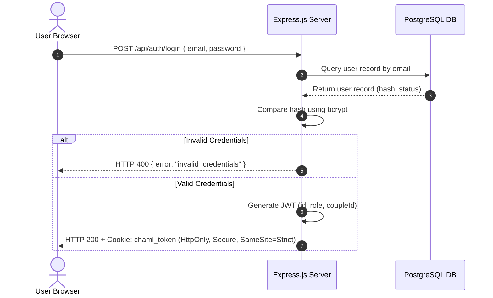
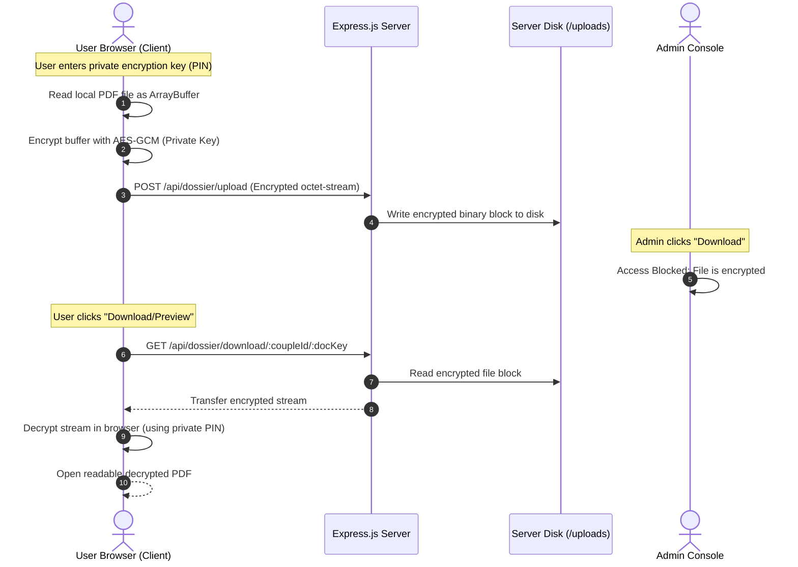

# System Architecture: Chaml App

This document provides a comprehensive overview of the technical stack, database schema, data flow sequences, and security controls implementing **Chaml** (SaaS family reunification management).

---

## 1. Technical Stack

| Layer | Technology | Role |
|---|---|---|
| **Frontend UI** | React.js (Vite) | Single-page application rendering checklists, simulators, and settings. |
| **Styling** | Vanilla CSS | Styling system featuring dark mode toggles and RTL support. |
| **API Client** | Native Fetch API | Queries Express backend using credentials mode to send cookies. |
| **Backend Server** | Node.js (Express) | Validates user input, parses cookies, handles upload logic, and runs database queries. |
| **Database** | PostgreSQL | Holds users, couples, checklists, logs, and system variables. |
| **Upload Storage** | Secure local storage | Private directory `/server/uploads` (can transition to Amazon S3). |

---

## 2. Database Schema (Entity-Relationship Diagram)

The following Mermaid diagram shows the database tables, data types, and relationships defined in `schema.sql`:

```mermaid
erDiagram
    site_config {
        int id PK "always 1"
        varchar app_name
        varchar app_logo
        numeric smic_value
        numeric surface_zone_a
        numeric surface_zone_b
        numeric surface_zone_c
        varchar smtp_host
        int smtp_port
        varchar smtp_user
        varchar smtp_password
        varchar smtp_protocol
        varchar smtp_sender_name
        varchar smtp_sender_email
    }
    couples {
        varchar id PK
        boolean is_approved
        timestamp submitted_at
        varchar dossier_status "draft|submitted|approved|rejected"
    }
    users {
        varchar id PK
        varchar email UNIQUE
        varchar password_hash
        varchar role "demandeur|beneficiaire|admin"
        varchar couple_id FK
        varchar first_name
        varchar last_name
        varchar phone
        varchar city
        varchar department
        varchar zone
        numeric living_surface
        int family_size
        boolean is_frozen
        boolean is_approved
        boolean is_email_verified
        timestamp created_at
    }
    documents {
        int id PK
        varchar couple_id FK
        varchar doc_key "fr_identity|fr_cerfa..."
        varchar owner "demandeur|beneficiaire"
        varchar category "identity|civil|income|housing"
        boolean required
        boolean uploaded
        varchar file_name
        varchar file_path
        timestamp uploaded_at
        varchar status "pending|approved|rejected"
        text comment
    }
    audit_logs {
        int id PK
        timestamp created_at
        varchar action
        text details
        varchar user_email
    }

    couples ||--o{ users : "contains"
    couples ||--o{ documents : "owns"
```

---

## 3. Data Flow Sequences

### A. Authentication Sequence (Signed HTTP-Only Cookie)
To prevent Cross-Site Scripting (XSS) token extraction attacks, session tokens (JWT) are stored in secure cookies that are invisible to client-side scripts.



---

## 4. End-to-End File Encryption Sequence (Zero-Knowledge)

All files (birth certificates, pay slips) are encrypted in the client browser using the **Web Crypto API (AES-GCM-256)** using a password/PIN known only to the user. The server receives and stores only the encrypted stream. The admin is blocked from accessing raw downloads.



---

## 5. Security & Privacy Boundary Controls
1. **Zero Server Visibility**: Since file keys are not sent to the server, data compromises on the VPS do not leak sensitive documents.
2. **Access Control**: Sessions require a matching cookie token to query any file descriptors, preventing enumeration.
3. **Audit Trails**: Actions (upload, delete, review) write immutable lines to the `audit_logs` table for administrative tracking.
